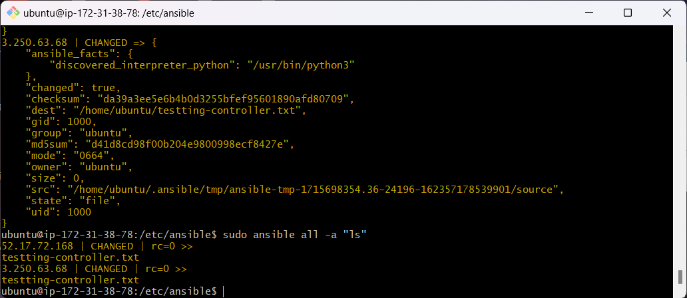

# Ansible Overview

## Introduction to Ansible

Ansible is an open-source automation tool used for configuration management, application deployment, and task automation. It allows IT administrators to automate tasks in a simple, yet powerful way using YAML files.

.png>)

## Ansible Architecture

### Ansible Control Machine

The control machine is the central server where Ansible is installed. It is responsible for executing the playbooks and managing the entire automation process. The control machine connects to managed nodes over SSH to push configurations and run tasks.

### Playbooks

Playbooks are YAML files that define a series of tasks to be executed on remote hosts. Each playbook consists of one or more "plays," and each play can target different groups of hosts. 

### Inventory

The inventory is a file that lists the managed nodes (hosts) and groups of hosts that Ansible will manage. It can be a simple static file or dynamically generated. The inventory file can be specified in different formats such as INI or YAML.

### Hosts

Hosts, also known as managed nodes, are the systems that Ansible manages. These can be physical servers, virtual machines, cloud instances, or even network devices. Hosts are defined in the inventory file and can be grouped for easier management.

### Ansible Agents

Ansible uses an agentless architecture, meaning it does not require any software to be installed on the managed nodes. Instead, it uses SSH to communicate with and manage the hosts.

---

## What, Why, How, and Where

### What is Ansible?

Ansible is an automation tool that helps IT administrators manage infrastructure by automating repetitive tasks, ensuring consistency, and improving efficiency.

### Why Use Ansible?

- **Simplicity**: Ansible uses human-readable YAML syntax, making it easy to write and understand playbooks.
- **Agentless**: No need to install agents on managed nodes, reducing overhead and complexity.
- **Idempotency**: Ensures that applying the same playbook multiple times will not alter the system's state if it is already configured correctly.
- **Community Support**: Ansible has a large, active community and extensive documentation, providing a wealth of resources and pre-built roles and modules.

### How Does Ansible Work?

Ansible works by connecting to managed nodes via SSH from the control machine. It then executes tasks defined in playbooks on these nodes. Tasks can include running commands, installing packages, managing files, and configuring services. Ansible modules (small programs that do specific tasks) are executed on the managed nodes to perform these tasks.

### Where Can Ansible Be Applied?

- **Configuration Management**: Maintain consistency in server configurations across multiple environments.
- **Application Deployment**: Automate the deployment of applications, ensuring all dependencies are met and configurations are applied.
- **Orchestration**: Manage the execution order of interdependent tasks across multiple systems.
- **Provisioning**: Set up new servers and environments in the cloud or on-premises.
- **Continuous Delivery**: Integrate with CI/CD pipelines to automate testing and deployment processes.


### Setting up Ansible

To set up ansible. Use the following commands.


Install the software-properties-common package, which allows you to manage software repositories easily:

```bash
sudo apt-get install software-properties-common
```
Add the Ansible PPA (Personal Package Archive) repository to your system:

```bash
sudo apt-add-repository ppa:ansible/ansible
```
Update the package index to ensure it includes the latest packages from the newly added repository:

```bash
sudo apt-get update -y
```
Finally, install Ansible:

```bash
sudo apt-get install ansible -y
```

### Communinicating with your EC2 with Ansible

We need to move the SSH key to the Ansible control machine to communicate with EC2 instances.

Secure Access: The SSH key is required to authenticate and  establish a secure connection to the EC2 instances. Without the SSH key, Ansible cannot connect to the instances.

To do this we need to move the key from our local machine.
```bash
scp -i ~/.ssh/tech258.pem ~/.ssh/tech258.pem ubuntu@3.252.237.34:~/.ssh/
```
Don't forget to change the ip to the one you're currently using.


Run the command 
```bash
cd /etc/ansible
```
The default Ansible configuration files are typically located, including ansible.cfg, and the default inventory file named hosts.

If you configure the hosts file. You can edit this file to add your EC2 instances. 
```bash
[app]

3.250.63.68 ansible_user=ubuntu ansible_ssh_private_key_file=~/.ssh/tech258.pem

[db]

52.17.72.168 ansible_user=ubuntu ansible_ssh_private_key_file=~/.ssh/tech258.pem
```
If you then run the following command:
```bash 
 sudo ansible all -m ping
```
- What It Does
    - Targets All Hosts: The command ansible all targets all hosts listed in the inventory file.
    - Uses Ping Module: The -m ping option specifies the use of Ansible's ping module to check connectivity.
    - SSH Authentication: Ansible uses the SSH keys specified in the inventory file to authenticate and connect to each host.

Successful output would look like this. 


Using Ansible to Copy Files to EC2 Instances
```bash
sudo ansible all -i hosts -m copy -a "src=/home/ubuntu/testing-controller.txt dest=/home/ubuntu/testting-controller.txt" 
```
The ansible command can be used to automate file transfers to multiple EC2 instances.

- What It Does
    - ansible all: Targets all hosts defined in the inventory.
    - -i hosts: Specifies the inventory file to use. Here, hosts is assumed to be located in the current directory.
    - -m copy: Specifies the Ansible module to use for copying files.
    - -a "src=/home/ubuntu/testing-controller.txt dest=/home/ubuntu/testting-controller.txt": Provides arguments to the copy module. It specifies the source file (src) and the destination file (dest) on the target hosts.
  
Successful output should look like.



